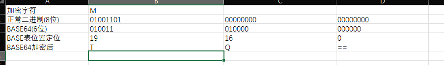

# BASE64

```
这个嘛 逆向中最简单的一种 有变表 魔改运算逻辑 自定义填充 爆破表 base隐写 等一些逆向点位
```

# 加密原理

```
base64的本质是位移
```

### 1. 核心逻辑：3 字节 $\rightarrow$ 4 字符

计算机以 8 位（bit）为一个字节，而 Base64 以 6 位为一个单元。

- ​**输入**​：3 个 8 位字节 \= **24 位**
- ​**输出**​：4 个 6 位单元 \= **24 位**

### 2. 执行三步走

1. ​**切分**：把二进制流每 6 位切一刀。
2. ​**查表**：这 6 位二进制对应的数值（0-63）就是索引，去索引表找对应的字符。
3. ​**补齐**：

   - 不满 3 字节时，在末尾补 `0` 凑够 6 位。
   - 为了告诉解码器补了几个字节，末尾增加 `=` 号（1 个或 2 个）。

### 3. 直观对比表

以字母 `M` 为例：

|**步骤**|**数据内容**|
| --| ----------------------------|
|**原始 ASCII**|​`M`|
|**二进制 (8位)**|​`01001101`|
|**重新分组 (6位)**|​`010011`|
|**十进制索引**|19|
|**查表结果**|​`T`|
|**最终结果**|​`TQ==`(补 2 个等号凑够 4 位)|

```
从上面看还是不太清楚 看下方的就能看懂了
```



  

|**索引 (Dec)**|**字符**|**索引 (Dec)**|**字符**|**索引 (Dec)**|**字符**|**索引 (Dec)**|**字符**|
| ----| --| ----| --| ----| --| ----| --|
|0|**A**|16|**Q**|32|**g**|48|**w**|
|1|**B**|17|**R**|33|**h**|49|**x**|
|2|**C**|18|**S**|34|**i**|50|**y**|
|3|**D**|19|**T**|35|**j**|51|**z**|
|4|**E**|20|**U**|36|**k**|52|**0**|
|5|**F**|21|**V**|37|**l**|53|**1**|
|6|**G**|22|**W**|38|**m**|54|**2**|
|7|**H**|23|**X**|39|**n**|55|**3**|
|8|**I**|24|**Y**|40|**o**|56|**4**|
|9|**J**|25|**Z**|41|**p**|57|**5**|
|10|**K**|26|**a**|42|**q**|58|**6**|
|11|**L**|27|**b**|43|**r**|59|**7**|
|12|**M**|28|**c**|44|**s**|60|**8**|
|13|**N**|29|**d**|45|**t**|61|**9**|
|14|**O**|30|**e**|46|**u**|62| **+**|
|15|**P**|31|**f**|47|**v**|63| **/**|

‍

# 代码实现

```1c
#include <stdio.h>
#include <stdlib.h>
#include <string.h>

// Base64 索引表
static const char base64_table[] = "ABCDEFGHIJKLMNOPQRSTUVWXYZabcdefghijklmnopqrstuvwxyz0123456789+/";

char* base64_encode(const unsigned char* data, int input_len) {
    // 计算编码后的长度：每3个字节变4个，且需4字节对齐
    int output_len = 4 * ((input_len + 2) / 3);
    char* encoded_data = (char*)malloc(output_len + 1);
    if (encoded_data == NULL) return NULL;

    for (int i = 0, j = 0; i < input_len; ) {
        // 读取 3 个字节（共 24 位）
        unsigned int octet_a = i < input_len ? data[i++] : 0;
        unsigned int octet_b = i < input_len ? data[i++] : 0;
        unsigned int octet_c = i < input_len ? data[i++] : 0;

        // 将 24 位组合成一个整数
        unsigned int triple = (octet_a << 16) + (octet_b << 8) + octet_c;

        // 分成 4 个 6 位的索引并查表
        encoded_data[j++] = base64_table[(triple >> 18) & 0x3F];
        encoded_data[j++] = base64_table[(triple >> 12) & 0x3F];
        encoded_data[j++] = base64_table[(triple >> 6) & 0x3F];
        encoded_data[j++] = base64_table[triple & 0x3F];
    }

    // 处理末尾的填充（Padding）
    int padding = (3 - (input_len % 3)) % 3;
    for (int i = 0; i < padding; i++) {
        encoded_data[output_len - 1 - i] = '=';
    }

    encoded_data[output_len] = '\0'; // 字符串结束符
    return encoded_data;
}

int main() {
    const char* msg = "Hello Gemini!";
    char* encoded = base64_encode((const unsigned char*)msg, strlen(msg));

    printf("原始字符串: %s\n", msg);
    printf("Base64 编码: %s\n", encoded);

    free(encoded); // 释放内存
    return 0;
}
```

#
